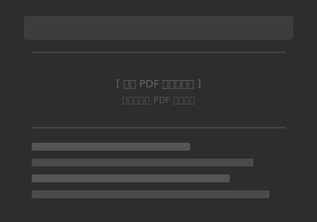
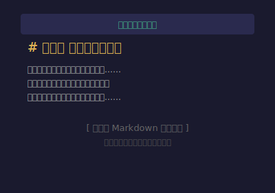
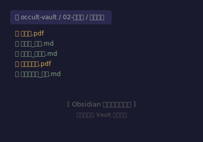
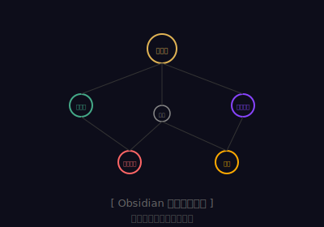

<p align="center">
  <picture>
    <source media="(prefers-color-scheme: dark)" srcset="screenshots/hero-dark.svg">
    
  </picture>
</p>

<p align="center">
  <strong>OCR 提取 → 精排版格式化 → AI 笔记生成 → Obsidian 知识网络</strong>
</p>

<p align="center">
  <a href="https://www.python.org/downloads/"></a>
  <a href="LICENSE"></a>
  <a href="https://github.com/KuuhhN/occult-ingest/stargazers"></a>
</p>

<p align="center">
  <i>把神秘学 PDF 变成一张互联的知识网络。</i>
  <br>
  从扫描件到结构化笔记，从单本书到跨体系的知识图谱 —— 一步到位。
</p>

---

## 📸 效果预览

> 🖼️ *以下为占位图，等你放入自己的 Obsidian 截图后效果更佳*

| 你拥有的 | 你得到的 |
|:---:|:---:|
| **原始 PDF**（扫描件/图片版） | **结构化 Markdown 笔记** |
|  |  |
| **一页页翻找信息** | **秒级检索 + 知识互联** |
|  |  |

---

## 🧠 它解决了什么问题？

神秘学（Occult）领域的经典文献通常：
- 📄 **只有扫描版 PDF**，无法搜索、复制、标注
- 🔍 **内容分散**，读完一本记不住，多本之间建立不起联系
- 🕸️ **知识体系庞大**（炼金术、卡巴拉、塔罗、占星学……），单篇笔记孤岛化

**Occult Ingest** 从 PDF 扫描件出发，最终生成一个 **互联的 Obsidian 知识库**——每本书的笔记通过双向链接自动关联到对应的知识体系，所有书在 MOC（内容地图）中交汇。

---

## 🔄 完整工作流

```
┌──────────────────────────────────────────────────────────────────┐
│                         Occult Ingest 流水线                       │
├──────────────────────────────────────────────────────────────────┤
│                                                                  │
│  📄 PDF 扫描件                                                    │
│      │                                                            │
│      ▼                                                            │
│  ╔══════════════════════════════════════════════════╗              │
│  ║  第 1 步：OCR 提取（腾讯云）                     ║              │
│  ║  ocr_extract.py → 带页码标记的 Markdown 原文     ║              │
│  ╚══════════════════════════════════════════════════╝              │
│      │                                                            │
│      ▼                                                            │
│  ╔══════════════════════════════════════════════════╗              │
│  ║  第 2 步：精排版格式化                           ║              │
│  ║  format_ocr.py → 去伪影/合并断句/Markdown 化    ║              │
│  ╚══════════════════════════════════════════════════╝              │
│      │                                                            │
│      ▼                                                            │
│  ╔══════════════════════════════════════════════════╗              │
│  ║  第 3 步：AI 生成三份结构化笔记                  ║              │
│  ║  ┌──────────────────────────────────────────┐   ║              │
│  ║  │ 📖 导读 → 一句话总结 + 核心要点 + 阅读导航 │   ║              │
│  ║  │ 📋 摘要目录 → 按章节分层，每节一段概括      │   ║              │
│  ║  │ 📝 精读笔记 → 保留 ~50% 信息量 + 页码标注  │   ║              │
│  ║  └──────────────────────────────────────────┘   ║              │
│  ╚══════════════════════════════════════════════════╝              │
│      │                                                            │
│      ▼                                                            │
│  ╔══════════════════════════════════════════════════╗              │
│  ║  第 4 步：关联到知识体系 + 生成 MOC             ║              │
│  ║  炼金术 → 卡巴拉 → 塔罗 → 占星学 → ……          ║              │
│  ╚══════════════════════════════════════════════════╝              │
│      │                                                            │
│      ▼                                                            │
│  🗺️  互联的 Obsidian 知识库                                       │
│                                                                  │
└──────────────────────────────────────────────────────────────────┘
```

---

## 💎 真实效果示例

以《炼金术》（徐德伟 著）为例，看看一本书经过 pipeline 后变成了什么：

### 📖 导读（1 页，3 分钟读完）

```markdown
## 📌 一句话总结
> 一本适合中文读者的炼金术入门全景书，
> 从古希腊一路讲到牛顿，既讲"怎么炼"也讲"为什么炼"。

## 🎯 核心要点
1. **炼金术不是迷信** — 中世纪化学的前身
2. **"炼金"也是"炼心"** — 荣格心理炼金术
3. **四大文明都有炼金传统**
4. **贤者之石是终极象征**
5. **牛顿花了大量时间在炼金术上**

## 📖 阅读导航
| 优先级 | 章节 | 理由 |
|--------|------|------|
| ⭐⭐⭐ | **前言** | 全书纲领 |
| ⭐⭐⭐ | **第一章** | 四大文明炼金史 |
| ⭐⭐ | **第四章** | 炼金大师真人真事 |
```

> 完整文件：[03-导读/《炼金术》导读.md](occult-ingest/examples/炼金术_导读.md)

### 📋 摘要目录（按章→节分层）

```
# 第一章 历史与传说之间
  - 古希腊炼金术的起源（p12–28）
  - 阿拉伯炼金术的发展（p29–45）
  - 欧洲中世纪炼金术（p46–68）
  - 中国炼金术传统（p69–85）

# 第二章 踏上天堂之路
  - 炼金哲学基础（p86–110）
  - 四元素说与三原质（p111–130）
  - 大小宇宙理论（p131–150）
  ...
```

### 📝 精读笔记（保留 ~50% 信息量，页码标注）

每个二级标题都标注了 Obsidian PDF 页码标签，点击即可跳转到 PDF 对应页面：
```
## 亚里士多德四元素说（p12–15）
四元素说为炼金术提供了理论基础。亚里士多德认为万物由
火、水、土、气四种元素构成……

## 赫尔墨斯传统（p16–20）
"as above, so below" 是炼金术的哲学基石……
```

### 🧩 知识互联

每本书自动关联到对应的知识体系，最终汇聚到 **MOC（内容地图）**：

```
┌─ 神秘学总览 ─────────────────────────────┐
│                                           │
│  🜁 炼金术  ←── 《炼金术》（徐德伟）      │
│            ←── Splendor Solis             │
│            ←── Herbal Alchemist           │
│                                           │
│  🜃 赫尔墨斯主义 ←── 翠玉录 / 凯巴莱恩     │
│                                           │
│  🝞 魔法实践 ←── 英灵魔法                  │
│                                           │
│  ☽ 灵修与冥想 ←── 《灵性炼金术》           │
│                                           │
└───────────────────────────────────────────┘
```

---

## 🚀 快速开始

### 1. 安装依赖

```bash
pip install pdfplumber tencentcloud-sdk-python-ocr pymupdf pangu
```

### 2. 配置腾讯云 OCR

注册 [腾讯云 OCR](https://console.cloud.tencent.com/ocr) 获取密钥：

```bash
export TENCENT_SECRET_ID="your_secret_id"
export TENCENT_SECRET_KEY="your_secret_key"
```

### 3. 处理第一本书

```bash
# 第1步：OCR 提取原文
python occult-ingest/ocr_extract.py "炼金术.pdf" "炼金术" "徐德伟"

# 第2步：格式化为精排版
python occult-ingest/format_ocr.py \
    "02-文献库/经典文献/炼金术_原文.md" \
    "02-文献库/经典文献/炼金术_精排版.md" \
    --title "《炼金术》" \
    --meta "徐德伟 编著 | 哈尔滨出版社 | 2006年8月第1版" \
    --headers "第一章 历史与传说之间,第二章 踏上天堂之路,第三章 神圣的艺术,第四章 见证永生之奥秘,CONTENTS,目录" \
    --raw-page-link "炼金术_原文"

# 第3步：AI 生成三份笔记（在 AI 对话中引用 SKILL.md 的流程说明）
# 第4步：关联到知识体系
```

---

## 📂 知识库结构（Obsidian Vault）

```
occult-vault/
├── 00-MOC/             ← 总览索引（跨体系知识地图）
│   ├── 神秘学总览.md
│   ├── 炼金术.md
│   ├── 卡巴拉.md
│   └── ...
├── 01-知识库/           ← 知识条目（按体系分目录）
│   ├── 炼金术/
│   │   ├── 《炼金术》徐德伟.md
│   │   ├── Splendor_Solis.md
│   │   └── Herbal_Alchemist.md
│   ├── 魔法实践/
│   └── 灵修与冥想/
├── 02-文献库/经典文献/   ← PDF + OCR 原文 + 精排版
│   ├── 炼金术.pdf
│   ├── 炼金术_原文.md
│   ├── 炼金术_精排版.md
│   └── ...
├── 03-导读/             ← AI 生成导读
├── 04-日志/             ← 每日学习记录
├── 05-摘要/             ← 分层摘要目录
├── 06-笔记/             ← 精读笔记~50% 密度
└── 99-模板/             ← 笔记模板
```

---

## 🛠️ 命令行参考

### ocr_extract.py

| 参数 | 说明 |
|------|------|
| `pdf_path` | PDF 文件路径（必需） |
| `title` | 书名 |
| `author` | 作者 |
| `--vault` | Obsidian Vault 根目录（默认自动探测） |
| `OCCULT_VAULT_PATH` | 同上，环境变量方式 |

### format_ocr.py

| 参数 | 说明 |
|------|------|
| `raw_path` | OCR 原文路径 |
| `out_path` | 精排版输出路径 |
| `--title` | 书名 |
| `--meta` | 出版元数据 |
| `--headers` | 印刷页眉列表（逗号分隔） |
| `--raw-page-link` | 原文 Obsidian 链接名 |

---

## 📸 占位截图说明

本仓库的 `screenshots/` 目录包含以下占位图，**等待你用自己的 Obsidian 截图替换**：

| 文件名 | 建议内容 |
|--------|---------|
| `hero-light.svg` / `hero-dark.svg` | 项目 Logo / 标题图（建议 1200×400） |
| `placeholder-pdf.svg` | 原始 PDF 扫描件截图 |
| `placeholder-polished.svg` | 精排版 Markdown 效果图 |
| `placeholder-vault.svg` | Obsidian 文件浏览器截图（展示目录结构） |
| `placeholder-graph.svg` | Obsidian 图谱视图（展示知识连接） |

**如何截图：**
1. 打开 Obsidian，打开你处理过的一本书
2. 按 `Ctrl+Shift+P` → 搜索"截图"或用系统截图工具
3. 保存到 `screenshots/` 目录，覆盖占位 SVG 文件

---

## 📜 开源协议

MIT License — 随便用，随便改，随便造。

## 🙏 致谢

- [腾讯云 OCR](https://console.cloud.tencent.com/ocr) — 中文 OCR 识别
- [pangu](https://github.com/vinta/pangu) — 中英文间距规范化
- [pdfplumber](https://github.com/jsvine/pdfplumber) — PDF 页面提取
- [pymupdf](https://pymupdf.readthedocs.io/) — PDF 页码标签读取
